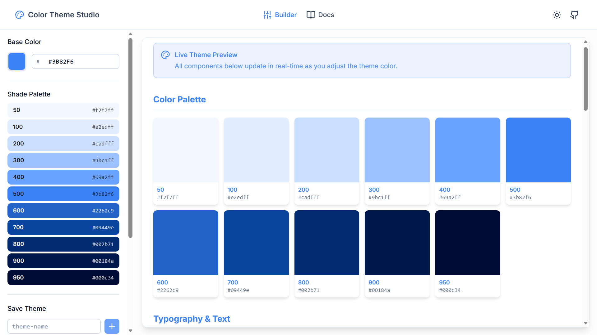
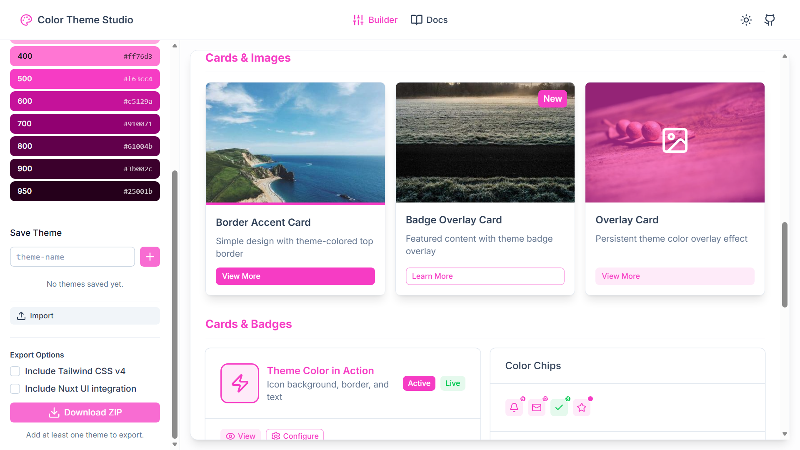
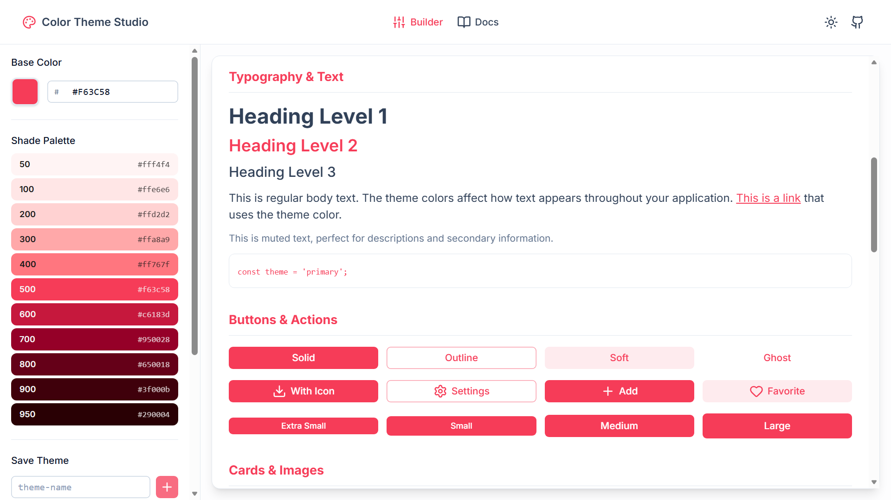
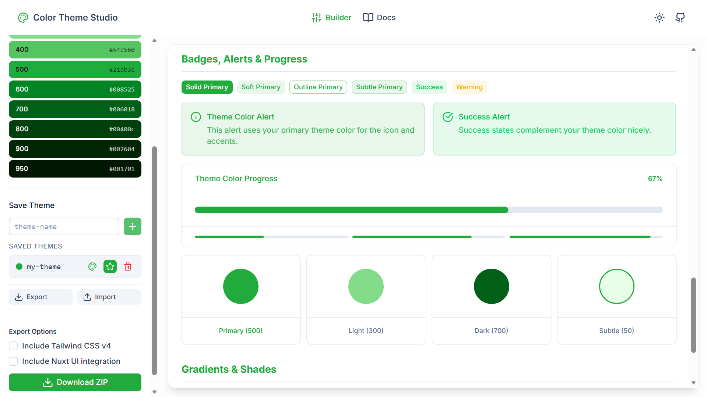
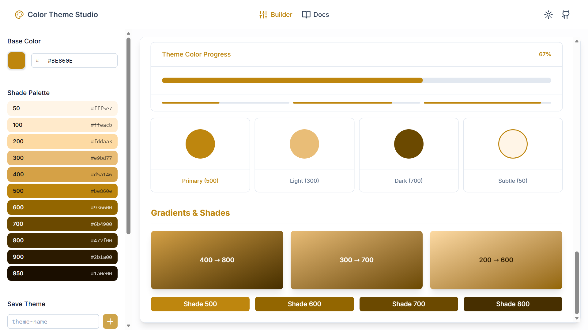

<div align="center">

<br/>

# 🎨 <br/> Color Theme Studio

<h3>Interactive Color Theme Designer for Any Web Apps</h3>

<p>
  Pick any color → Generate OKLCH palettes → Preview live → Export as CSS, JS & TypeScript<br/>
  <em>With runtime switching, localStorage persistence, and Tailwind CSS v4 support</em>
</p>

<br/>

[](https://nuxt.com/)
[](https://www.typescriptlang.org/)
[](LICENSE)
[](https://github.com/liorcodev/color-theme-studio/actions/workflows/deploy.yml)

[Try it live](https://liorcodev.github.io/color-theme-studio) • [Features](#-features) •
[How It Works](#-how-it-works) • [Generated Files](#-generated-files) •
[Documentation](#-documentation)

---



</div>

## ✨ Features

- 🎨 **OKLCH Shade Generation** - Perceptually uniform 11-stop palettes (50-950) from any base color
- 👁️ **Live Preview** - See your theme applied instantly across a full UI component demo
- 🌈 **Multi-Theme Support** - Build and manage unlimited named themes in one session
- 📦 **One-Click Export** - Download a ZIP with `theme.css`, `theme.js`, and `theme.d.ts`
- 🔃 **Import/Export Theme Lists** - Save your entire theme collection as JSON and share or back up
- 🎭 **Runtime Theme Switching** - Exported `theme.js` includes a full `ColorTheme` API
- 💾 **localStorage Persistence** - Active theme survives page reloads automatically
- 📘 **TypeScript Declarations** - Optional `.d.ts` for full autocomplete and type safety
- 🎯 **Tailwind CSS v4 Ready** - Optional automatic `@import` and `@theme` block integration
- 🎨 **Nuxt UI Integration** - Optional automatic `--ui-primary` color binding
- 🚀 **Zero Install** - Runs entirely in the browser, no setup

---

## 📸 Screenshots

<div align="center">



<br/><br/>

<table>
  <tr>
    <td width="50%">
      
    </td>
    <td width="50%">
      
    </td>
  </tr>
</table>

<br/>



</div>

---

## 🚀 How It Works

### 1. Pick a Color

Open the **Builder** tab and use the color picker or type a hex value. The 11-shade OKLCH palette
generates instantly in the sidebar.

### 2. Name and Add Your Theme

Give your palette a name (e.g. `ocean-blue`) and click **Add**. Repeat for as many themes as you
need - they all appear in the Theme List.

### 3. See It Live

The main panel previews your active theme across a full set of real UI components - buttons, badges,
cards, alerts, forms, and more - updating in real time as you switch themes.

### 4. Save and Share (Optional)

Click **Export** to download your entire theme collection as a secure JSON file. Share it with your
team or import it later to restore your themes. All data is validated to prevent security issues.

### 5. Download and Use

Click **Download ZIP** to get three ready-to-use files:

| File         | Purpose                                                          |
| ------------ | ---------------------------------------------------------------- |
| `theme.css`  | CSS custom properties (`--color-theme-50` → `--color-theme-950`) |
| `theme.js`   | `ColorTheme` runtime API with localStorage and event support     |
| `theme.d.ts` | TypeScript declarations for full type safety                     |

> **Note:** The theme collection export (JSON) is separate from the code export (ZIP). Use Export/Import
> buttons in the theme list to save and restore your full theme library.

---

## 💡 Using the Generated Files

### Drop into Any HTML Project

```html
<!DOCTYPE html>
<html lang="en">
  <head>
    <link rel="stylesheet" href="theme.css" />
    <script src="theme.js"></script>
  </head>
  <body>
    <div style="background: var(--color-theme-500); color: var(--color-theme-50);">Hello World</div>

    <button onclick="ColorTheme.change('sunset-red')">Switch Theme</button>
  </body>
</html>
```

### CSS Variables

Every theme exposes 11 shades as CSS custom properties:

```css
.card {
  background: var(--color-theme-50);
  color: var(--color-theme-900);
  border: 1px solid var(--color-theme-200);
}

.btn-primary {
  background: var(--color-theme-500);
  color: #fff;
}
.btn-primary:hover {
  background: var(--color-theme-600);
}
```

### JavaScript API - `ColorTheme`

```javascript
// Switch theme (persisted to localStorage)
ColorTheme.change('sunset-red');

// Get all available themes
const themes = ColorTheme.getThemes();
// [{ name: 'ocean-blue', color: '#3b82f6' }, ...]

// Get current theme name
const current = ColorTheme.getCurrentTheme();

// React to theme changes
document.documentElement.addEventListener('themechange', e => {
  console.log('Theme changed to:', e.detail.theme);
});
```

### TypeScript Support

```typescript
/// <reference path="./theme.d.ts" />

// ✅ Autocomplete for theme names
ColorTheme.change('ocean-blue');

// ✅ Typed event handler
document.documentElement.addEventListener('themechange', (e: ThemeChangeEvent) => {
  console.log(e.detail.theme); // typed as ThemeName
});
```

### Tailwind CSS v4

```css
@import 'tailwindcss';

@theme {
  --color-theme-50: var(--color-theme-50);
  --color-theme-100: var(--color-theme-100);
  --color-theme-500: var(--color-theme-500);
  --color-theme-900: var(--color-theme-900);
  /* add all shades as needed */
}
```

Then use `bg-theme-500`, `text-theme-900`, etc. in your markup.

### Nuxt UI Integration

```css
@import '@nuxt/ui';

:root {
  --ui-primary: var(--color-theme-500);
}
```

Now all Nuxt UI components will use your theme colors.

---

## 📖 Documentation

Full API reference, React integration examples, and Tailwind setup are available in the
**[Docs tab](https://liorcodev.github.io/color-theme-studio/docs)** inside the app itself.

---

## 🛠️ Development

```bash
# Install dependencies
bun install

# Start dev server
bun run dev

# Build for production (GitHub Pages)
bun run build

# Preview production build locally
bun run preview
```

---

## 🤝 Contributing

Contributions are welcome! Feel free to open an issue or submit a pull request.

---

## 📝 License

MIT © Lior Cohen
